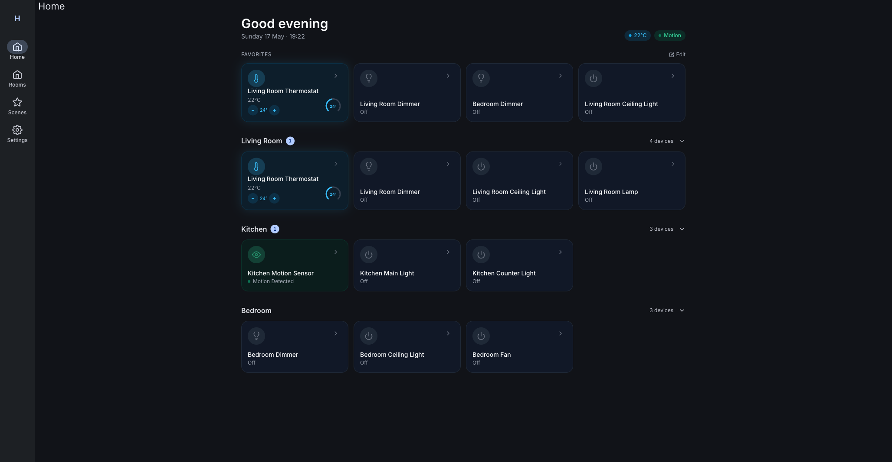
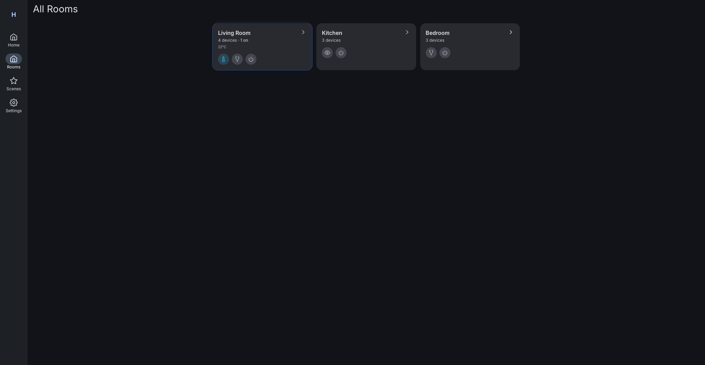
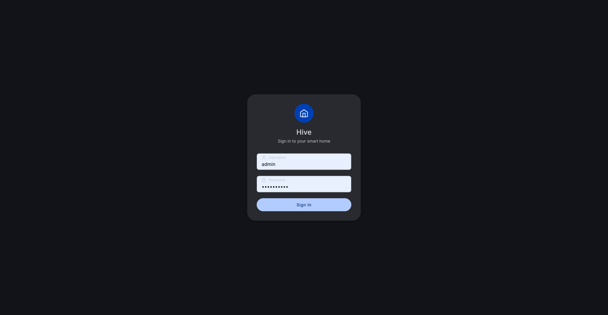
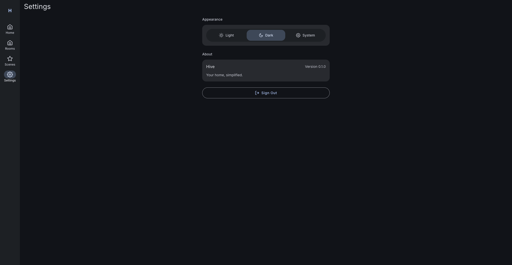

# Hive Smart Home Platform

> Local-first, white-labeled smart home platform powered by Home Assistant Core.

## Quick Start

### Prerequisites
- **Docker** — [Docker Desktop](https://www.docker.com/products/docker-desktop/) (Mac/Windows) or [OrbStack](https://orbstack.dev/) (Mac, recommended — faster)
- **Git**
- **Python 3.10+** (for seed scripts)

### 1. Clone & configure
```bash
git clone <repo-url> hive-platform
cd hive-platform
cp .env.example .env   # then edit .env with your HA token and secrets
```

### 2. Start all services (development)
```bash
docker compose up --build -d
```
This builds and starts all 5 containers in the background. First run takes a few minutes to pull images and build.

### 3. Verify everything is running
```bash
docker compose ps
```
All containers should show `running`. 

### 4. Seed Home Assistant (first run only)
```bash
python3 scripts/seed-ha.py
```
Creates the admin user, access token, and rooms/areas in HA.

### 5. Open the app
Navigate to **http://localhost:3000** and log in with the admin credentials from your `.env` file.

### Services

| Service | URL | Purpose |
|---------|-----|---------|
| Branded Web UI | http://localhost:3000 | Customer-facing UI |
| API Gateway | http://localhost:8000 | Branded API (frontend talks to this) |
| Home Assistant | http://localhost:8123 | Backend (dev debugging only — hidden from users) |
| Mosquitto MQTT | localhost:1883 | Device message bus |

### Common Commands

```bash
# Start all services
docker compose up -d

# Start and rebuild (after code changes)
docker compose up --build -d

# Stop all services
docker compose down

# Restart a single service (e.g. gateway after code changes)
docker compose up --build -d gateway

# View logs (all services)
docker compose logs -f

# View logs for a specific service
docker compose logs -f gateway

# Rebuild from scratch (clean slate)
docker compose down -v && docker compose up --build -d
```

### Production Mode
```bash
docker compose -f docker-compose.prod.yml up --build -d
```
Uses optimized multi-stage builds, non-root users, nginx for static serving, and health checks.

## Screenshots

| Home | Rooms | Login |
|------|-------|-------|
|  |  |  |

| Scenes | Settings |
|--------|----------|
|  |  |

## Architecture
```
Browser/Tablet → Web UI (:3000) → API Gateway (:8000) → Home Assistant (:8123) → Devices
                                                                    ↕
                                                              MQTT (:1883)
                                                                    ↕
                                                          Physical Devices
```

The API Gateway fully abstracts Home Assistant. The frontend never knows HA exists.

## Project Structure
```
hive-platform/
├── docker-compose.yml          # Full local stack
├── docker-compose.pi.yml       # Raspberry Pi overrides (Phase 6)
├── .env.example                # Environment template
├── docs/                       # Research, runbooks, task specs
├── homeassistant/config/       # HA configuration
├── mqtt/                       # Mosquitto config
├── gateway/                    # FastAPI gateway service
├── web/                        # React branded UI
├── firmware/esphome/           # ESPHome device configs
├── simulators/virtual-devices/ # MQTT virtual switches
├── scripts/                    # Bootstrap, seed, utilities
└── tests/e2e/                  # Playwright E2E tests
```

## Platform Notes

### Mac (OrbStack recommended)
OrbStack is significantly faster than Docker Desktop for Mac. Install from https://orbstack.dev/.

### Mac (Docker Desktop)
Works out of the box. Ensure you allocate at least 4GB RAM in Docker Desktop settings.

### Windows
- Requires **WSL2** backend for Docker Desktop
- Install WSL2: `wsl --install` in PowerShell (admin)
- Install Docker Desktop with WSL2 backend
- Clone the repo inside WSL2 filesystem for best performance: `\\wsl$\Ubuntu\home\<user>\`

### Port Conflicts
If ports are already in use:
- HA (8123): `HA_PORT=8124` in `.env`
- Gateway (8000): `GATEWAY_PORT=8001` in `.env`
- Web (3000): `WEB_PORT=3001` in `.env`
- MQTT (1883): `MQTT_PORT=1884` in `.env`

## License
Placeholder — TBD before commercial use.
